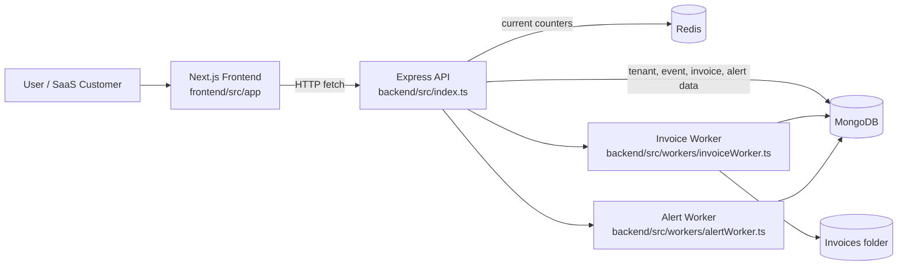

 ScaleBill Architecture

## Overview

ScaleBill is a multi-tenant SaaS billing platform for usage-based pricing, real-time metering, automated invoicing, and threshold alerts. The repository is organized as a local monorepo with a Next.js frontend and a TypeScript Express backend. The backend owns the data model, usage aggregation, pricing calculations, and invoice or alert generation logic.

The current implementation is intentionally simple in deployment shape but production-oriented in domain boundaries:

- Frontend: Next.js dashboard with live tenant selection, usage entry, charts, invoice history, and alert visibility.
- Backend: Express API with MongoDB persistence and Redis counters.
- Workers: invoice generation and usage alert checks are implemented as backend modules that can be run synchronously from API routes or moved to scheduled jobs later.
- Storage: MongoDB for durable history and metadata, Redis for fast current-state counters, and local PDF storage for generated invoices.

## System Goals

The architecture is designed to solve the core problems shown in the product concept:

- capture usage without depending on batch-only billing
- support multiple tenants with strict logical isolation
- calculate tiered charges quickly from live usage
- generate invoices automatically at the end of a billing period
- warn customers before they cross plan limits
- surface the current state in a self-service dashboard

## High-Level Architecture

## Repository Layout

| Path                                   | Responsibility                                                       |
| --------------------------------------- | --------------------------------------------------------------------|
| `frontend/src/app`                     | Dashboard UI, layout, and global styles                              |
| `backend/src/index.ts`                 | HTTP API, request orchestration, seeding, and static invoice hosting |
| `backend/src/db.ts`                    | MongoDB and Redis connection setup                                   |
| `backend/src/models.ts`                | Tenant, usage event, invoice, and alert schemas                      |
| `backend/src/pricing.ts`               | Tier definitions and billing calculation logic                       |
| `backend/src/workers/invoiceWorker.ts` | Invoice aggregation and PDF generation                               |
| `backend/src/workers/alertWorker.ts`   | Threshold detection and alert creation                               |
| `docs/architecture.md`                 | Canonical architecture document                                      |
| `docker-compose.yml`                   | Local MongoDB and Redis infrastructure                               |

## Runtime Components

### Frontend

The frontend is a client-rendered Next.js app that acts as the operator dashboard. It talks directly to the backend API at `http://localhost:4000/api` and renders:

- tenant selection and seeding actions
- usage ingest controls for API calls, storage, and bandwidth
- live usage meters and percentage badges
- trend charts built with Recharts
- invoice history and alert history
- manual invoice and alert triggers for demo and admin workflows

The dashboard is intentionally data-driven. It does not own business logic beyond presentation and form handling.

### Backend API

The backend is a single Express process that coordinates all core billing flows. It exposes endpoints for tenants, usage ingestion, dashboard queries, invoice generation, alert checks, and demo seeding.

The backend also serves generated PDFs from the `invoices/` directory using a static route, so invoice records can store a stable file path while the browser downloads the file directly.

### Redis

Redis stores the current usage counters for each tenant, metric, **and billing period**. This gives the platform fast reads for dashboard rendering and threshold checks without having to aggregate MongoDB history on every request, and it makes counters reset naturally at period boundaries instead of requiring an explicit reset job.

Current key shape:

- `usage:{tenantId}:api_calls:{periodKey}`
- `usage:{tenantId}:storage_gb:{periodKey}`
- `usage:{tenantId}:bandwidth_gb:{periodKey}`

`periodKey` is the billing period identifier (e.g. `2026-07` for a calendar-month plan). The dashboard and alert worker always read the counter for the tenant's *current* period, so live usage shown to the customer is scoped to the period being billed, not a lifetime total.

> Note: this replaces the original flat key shape (`usage:{tenantId}:{metric}`), which had no way to distinguish "usage this period" from "usage ever" — under the original scheme, a tenant's live meter would keep climbing forever and never reflect a new billing cycle starting. If you'd rather keep flat keys and reset them explicitly when an invoice is generated, that also works, but it means invoice generation and counter reset become coupled and must happen atomically (or you risk double-counting/losing usage in the reset window). The period-suffixed key avoids that coupling.

### MongoDB

MongoDB stores the durable record of the system:

- tenant configuration
- usage events
- invoice history
- usage alerts

The data model uses `tenantId` on every tenant-scoped document to keep the isolation model simple and predictable.

## Data Model

### Tenant

The tenant document stores the customer identity and its active plan limits.

Fields:

- `tenantId`
- `name`
- `planType`
- `email`
- `apiLimit`
- `storageLimit`
- `bandwidthLimit`
- `billingAnchorDay` — day of month the billing period starts/resets (defaults to `createdAt` day)
- `createdAt`

Indexes:

- unique index on `tenantId`
- compound index on `tenantId` and `createdAt`

### UsageEvent

Each usage event is appended to MongoDB so historical reporting and invoice periods can be reconstructed.

Fields:

- `tenantId`
- `metric` (`api_calls`, `storage_gb`, `bandwidth_gb`)
- `amount`
- `timestamp`
- `idempotencyKey` (optional, client-supplied) — lets the ingestion endpoint safely retry a submission without double-counting usage

Indexes:

- index on `tenantId`
- compound index on `tenantId`, `metric`, and `timestamp`
- unique sparse index on `idempotencyKey`

### Invoice

Invoice records capture the billing result for a specific period.

Fields:

- `tenantId`
- `invoiceNumber`
- `periodStart`
- `periodEnd`
- `baseFee`
- `overageFee`
- `totalFee`
- `usageSummary`
- `pdfPath`
- `status`
- `createdAt`
- `emailSent`

**Invoice numbering:** generated as `{tenantShortCode}-{YYYYMM}-{sequence}`, where `sequence` is a per-tenant, per-month counter (e.g. maintained via a Mongo `findOneAndUpdate` upsert with `$inc`, not an app-level in-memory counter, so it stays correct under concurrent invoice generation). This avoids collisions across tenants and keeps numbers human-readable.

### Alert

Alert records represent threshold crossings for a specific tenant and metric.

Fields:

- `tenantId`
- `metric`
- `thresholdType` (`80%` or `95%`)
- `usageValue`
- `limitValue`
- `periodKey` — billing period the alert belongs to
- `createdAt`

**Deduplication rule:** at most one alert per `(tenantId, metric, thresholdType, periodKey)`. This is what "checks for a recent duplicate alert" means concretely — without a period scope, "recent" is ambiguous and either spams the tenant every time the alert worker runs, or silently suppresses a legitimate new-period alert if the check window is too wide.

## Pricing Architecture

The pricing engine in `backend/src/pricing.ts` is a pure in-memory calculator. It looks up the plan definition and computes overage costs for each resource metric in constant time.

Plan configuration currently includes:

- Starter: INR 999 base fee
- Pro: INR 4,999 base fee
- Enterprise: INR 19,999 base fee

Each plan defines its own resource limits and overage rates for:

- API calls
- storage in GB
- bandwidth in GB

This keeps billing deterministic and fast enough to run inside the request path or inside the invoice worker.

## Request and Job Flows

### Tenant setup

1. A tenant is created through `POST /api/tenants`.
2. The backend validates the selected plan.
3. Tenant limits are copied from the pricing table into MongoDB.
4. Redis counters are initialized to zero for the new tenant's current period.

### Usage ingestion

1. The frontend submits usage through `POST /api/usage`, optionally with an `idempotencyKey`.
2. The backend validates the tenant and metric, and checks for a duplicate `idempotencyKey` if supplied.
3. Redis is incremented immediately for the live, period-scoped counter.
4. The event is written to MongoDB for durable history.
5. The alert worker runs asynchronously against the tenant's current usage.

### Dashboard read path

1. The frontend loads tenant data from `GET /api/dashboard/:tenantId`.
2. The backend reads the current period's totals from Redis.
3. It calculates live billing with the pricing engine.
4. It fetches recent invoices, alerts, and 14-day usage history from MongoDB.
5. The frontend renders charts and tables from that combined payload.

### Invoice generation

1. A tenant is selected and `POST /api/invoices/generate` is called.
2. The invoice worker aggregates usage for the target billing period from MongoDB (the durable record — Redis is not the source of truth for invoicing, only for live display).
3. The pricing engine computes base fee and overage.
4. A PDF invoice is generated with PDFKit and written to the invoices directory.
5. An invoice document is persisted in MongoDB, with a sequence-generated `invoiceNumber`.
6. The worker simulates S3 upload and SES delivery through logs.

> Note: `S3_BUCKET` and `SES_FROM_EMAIL` are configured as env vars but the current implementation only logs simulated calls — PDFs stay on local disk and no email is actually sent. That's fine for a demo, but worth flagging so it isn't mistaken for working delivery later.

### Alerting

1. The alert worker reads current usage from Redis for the tenant's active period.
2. It compares each metric to the tenant's plan limits.
3. When a metric crosses 80 percent or 95 percent, the worker checks for an existing alert with the same `(tenantId, metric, thresholdType, periodKey)`.
4. If none exists, a new alert is saved to MongoDB and a simulated SNS message is emitted.

## API Surface

The backend currently exposes these routes:

- `GET /api/tenants`
- `POST /api/tenants`
- `POST /api/usage`
- `GET /api/dashboard/:tenantId`
- `POST /api/invoices/generate`
- `POST /api/alerts/check`
- `POST /api/seed`

These routes are sufficient for the dashboard demo and for exercising the complete billing loop end to end.

## Local Infrastructure

Local development uses Docker Compose for the stateful dependencies:

- MongoDB on the default local database connection
- Redis on the default local cache connection

The backend reads environment variables from the repo root `.env` file. The main runtime defaults are:

- `MONGODB_URI`
- `REDIS_URL`
- `PORT`
- `S3_BUCKET`
- `SES_FROM_EMAIL`
- `SNS_ALERT_TOPIC_ARN`

## Known Gaps (flagged, not yet addressed)

These are worth a decision before this goes past demo stage — none are fixed in this revision because they depend on product/business choices:

- **No authentication or authorization** on any route. Every tenant's data is currently reachable by anyone who can call the API. This is already noted under Scalability, but it's a correctness/security gap, not just a scaling one — worth prioritizing before any real usage data flows through this.
- **Single-process, local-disk PDF storage** means invoices are lost if the container is recreated, and won't work once you run more than one backend instance. Fine for now, but flag it before adding a second instance or a queue-based worker.
- **No rate limiting** on `POST /api/usage`, so a misbehaving or malicious client can drive Redis/Mongo writes unbounded.

## Scalability Notes

The current shape is good for a demo or a small production deployment, and it can be evolved toward a fuller distributed architecture later:

- move alert and invoice processing to queue-backed background jobs
- keep Redis as the live counter store
- use MongoDB as the system of record for auditability
- offload PDFs to real object storage instead of the local file system
- add tenant-level auth and role-based access control before exposing the API publicly
- introduce observability for request latency, queue lag, and invoice generation success rates

## Current Implementation Summary

In short, ScaleBill is a two-tier application with a shared backend service and a responsive dashboard frontend. The important architectural choice is the split between fast mutable state in Redis and durable billing history in MongoDB. That split keeps the dashboard responsive, the pricing engine simple, and the invoice and alert workflows easy to extend.
